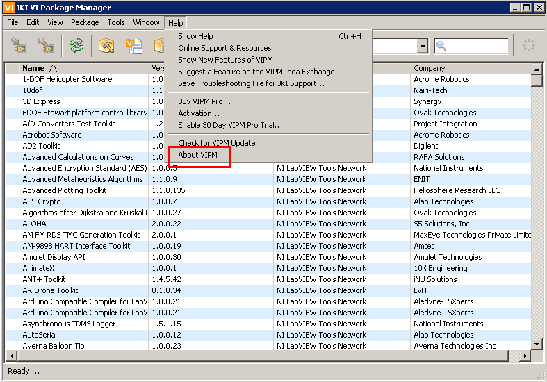
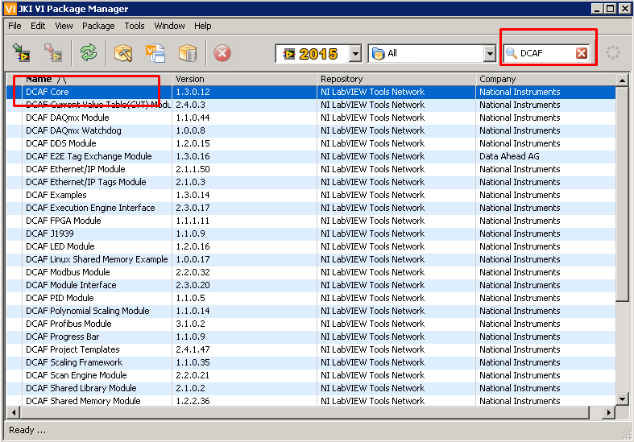
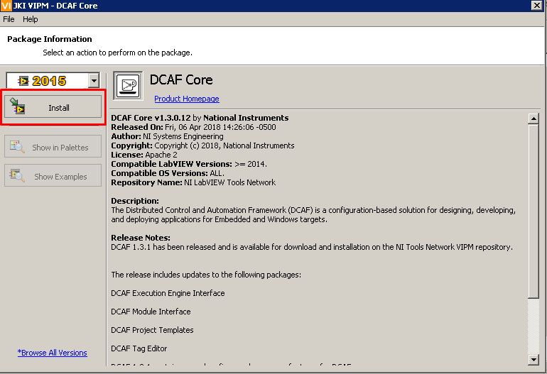
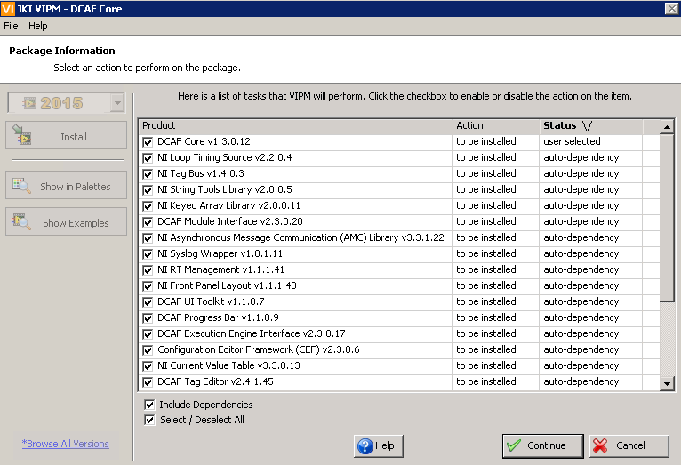
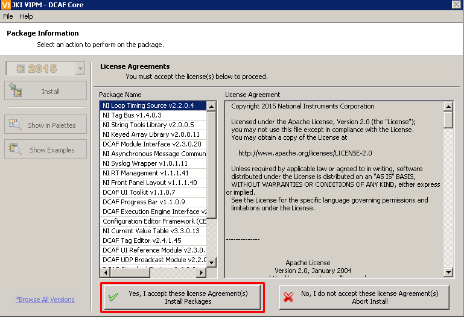

**Installing Software for DCAF Training**

Follow the instructions below to install DCAF and its dependencies on top of LabVIEW to prepare a computer for a DCAF Training.

1. Install LabVIEW 2014 or greater. 
2. Make sure the JKI VI Package Manager (VIPM) 2014 or later is installed. Version 2013 and earlier are incompatible with the DCAF VI packages. To verify the VIPM version go to Help > About VIPM.

3. Using the search bar on the top right, search for DCAF. The list of software will update with several DCAF components. Double-click to install the DCAF Core component. 

4. The package information related to the DCAF Core will show up. Select Install to continue. 

5. By default, VIPM will also try to install all the dependencies of this module as well. Keep them selected and click on Continue.

6. VIPM will start downloading the DCAF core and its dependencies. This process will take a few minutes. 
7. Click Yes to accept the license agreements.

8. VIPM will now connect to LabVIEW to get these packages installed.
9. At some point you may be asked to install Graphviz. If this is the case, follow the necessary steps to get it installed. 
10. At some point you may be asked to install PuTTY. If this is the case, follow the necessary steps to get it installed. 
11. Once all the components are correctly installed, VIPM will take some time to mass compile all the VIs to the corresponding version of LabVIEW. This process may take several minutes. 
