# Hands-On 1: Creating a DCAF Application

This hands-on covers the basics of implementing an application in the Distributed Control and Automation Framework, including using an existing module and developing a new control module. It doesn’t cover development of a new generic I/O or processing module. For this hands on, the framework downloads, and additional documentation, visit ni.com/dcaf

<!-- TOC depthFrom:1 depthTo:6 withLinks:1 updateOnSave:1 orderedList:0 -->

- [Hands-On 1: Creating a DCAF Application](#hands-on-1-creating-a-dcaf-application)
			- [Setup](#setup)
	- [Introduction](#introduction)
	- [Exercise 1:](#exercise-1)
				- [Standard Modules](#standard-modules)
				- [Custom Modules<!-- TOC depthFrom:1 depthTo:6 withLinks:1 updateOnSave:1 orderedList:0 -->](#custom-modules-toc-depthfrom1-depthto6-withlinks1-updateonsave1-orderedlist0-)
		- [Part A: Project Creation and UI](#part-a-project-creation-and-ui)
		- [Part B: Adding Required Classes](#part-b-adding-required-classes)
		- [Part C: Mapping Tags in the Configuration Editor](#part-c-mapping-tags-in-the-configuration-editor)
	- [Exercise 2: Adding Standard Modules to the Temperature Control Application (TDMS & CVT)](#exercise-2-adding-standard-modules-to-the-temperature-control-application-tdms-cvt)
		- [Part A: Add TDMS](#part-a-add-tdms)
		- [Part 2: Add CVT](#part-2-add-cvt)

<!-- /TOC -->

#### Setup
To install DCAF in LabVIEW open VI Package Manager (VIPM), search for DCAF, and install in the corresponding LabVIEW version. This package can be installed to any LabVIEW version from 2015 to present. A CompactRIO controller is not required.

## Introduction
Most control applications have similar challenges and needs. By working with different large control applications, we managed to identify most of this common challenges and needs and created DCAF to provide a standard framework to develop control applications.

Most of these challenges are related to having different processes running in parallel that need to share data without falling into race conditions. DCAF provides the capability of creating synchronized engines to run standard and custom modules and defining the mapping of data between them through a simple interface known as the Configuration Editor.

Before we start with the Exercises we need to understand some basic terminology of how a DCAF system is structured.

**System**: Your System will consist of one or more targets containing the one or more **DCAF Engines**. 
**Target**: A **Target** will represent the physical device that will run one or more **Engines**. A **Target** could be a PC or a CRIO. 
**Engine**: The Engine will be in charge of executing **Modules** in a synchronous way and transfer data between them through the **Tag Bus**. 
**Module**: Piece of code with a specific functionality that will be executed within an Engine. Some standard Modules are installed with DCAF, but you can create your own modules. 

Once we have defined the terminology to understand the hierarchy of a DCAF system, we need to understand how the data flows through a DCAF system. Data can be passed between **Modules, Engines** and even **Targets**.  Here is some more terminology related to dataflow in DCAF.

**Channels**: Parameters that allow access to and from a **Module**. Channels can be Inputs, Outputs, Processing Parameters and Processing Results – note that the direction is taken to be from the engine’s point of view.  
**Tags**: Scalar variables saved in a single repository (**Tag Bus**) that can be accessed by any **Module** within an **Engine**. A **Tag** can be defined as a connecting point between **Channels** from different **Modules**. 
**Mappings**: Mappings are the connections between **Tags** and **Channels**. If you want a specific Channel to write or read a value on a specific **Tag** you will have to map them.

Take the following example to clarify the previous terminology. Let’s say a Module called **Temperature Chamber Model** has an Input Channel called T**hermocouple Reading** – the module implements reading from a thermocouple and puts the value into the **Thermocouple Reading** channel. This **Thermocouple Reading Channel** is mapped to a Tag called **Temperature** – the engine will then take the value that the module places onto the channel and put it on the tag. Then the **Temperature** Tag’s value is passed by the engine to Temperature, an Output Channel that belongs to a module called **Temperature Controller Logic**.

## Exercise 1:
This exercise demonstrates the implementation of a simple temperature chamber controller application. It makes use of a model of the chamber to simulate its I/O and allows users to define the setpoint and PID gains of the control algorithm through a simple user interface.

During the exercise you will learn to identify how inputs and outputs from different modules are mapped within DCAF to provide communication between modules.  You will also learn how to create a UI and map it to data within the framework.

Our **Simulated Temperature Controller** will consist of 2 **DCAF Engines**: the **UI** and the **Temperature Controller Simulation**.

||
|:--:|
|*Figure 1.1*|

In the hierarchy shown above you can find some of the components defined in the previous section. In each of these **Engines** you will find **Modules**. Some of these **Modules** are standard and some of them were created specifically for this Hands On.

##### Standard Modules

**UDP**: This module exists in both components. It is designed to share tags between Engines by mapping each tag as an Engine Input or Output. All tags that are intended to be shared between engines need to be defined in the Tags Pane of each engine with the same names.

**UI Reference**: This module takes a pre-existing front panel and maps its controls and indicators to DCAF tags to permit direct user interaction with the framework.

##### Custom Modules

**Temperature Controller Logic**: This is a custom DCAF Module designed to provide the control logic for the temperature chamber. If the Simulation Engine is moved to a cRIO Target and the Temperature Chamber Model is replaced with real IO, this module could remain the same.

**Temperature Chamber Model**: This module provides a simulated model of a Temperature Chamber. This module could be replaced or overwritten to eventually provide IO from a real Temperature Chamber.

### Part A: Project Creation and UI
During this first part of the exercise you will create a DCAF project from scratch using a template and learn how to add a User Interface to your DCAF project.

1.	In LabVIEW go to **File >> Create Project..**. In the *Create Project* window select DCAF in the left pane. From the displayed list select **DCAF Basic Execution Template** and press the **Next** button.
2.	Name the project **Temperature Controller** and select **\\Hands On\Hands-On_1\Exercises\Temperature Controller\Runtime\Project** as the Project Root.
3. Click *Finish* to start scripting your runtime project from this template.
4.	Verify your project window matches Figure 1.2.

|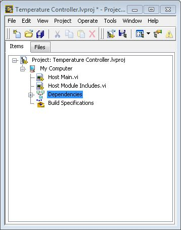|
|:--:|
|*Figure 1.2*|

5.	Add to the project a configuration file with the Engines for the Temperature Controller partially configured and mapped (in future exercises you will make a configuration file from scratch). In the project explorer, right-click **My Computer**, select *Add* and navigate to the  **SimulatedSystem.pcfg** file located at **\\Hands On\Hands-On_1\Exercises\Temperature Controller**.
6.	To speed up the exercise, a User Interface VI has already been created for you. In the project explorer, right-click **My Computer**, select *Add* and navigate to the **TCRL User Interface.vi** file located at **\\Hands On\Hands-On_1\Exercises\Temperature Controller\Runtime.**
7.	Open the **TCRL User Interface.vi**. Look at the names of the Labels in the Block Diagram. This is important to correctly map the tags to the UI. Controls and Indicators will be directly updated through the DCAF UI Engine, so there is no need to add more code in this VI. Save and Close **TCRL User Interface.vi**.

||
|:--:|
|*Figure 1.3*|

8.	Open the **Host Main.vi** Block Diagram. You will modify this VI to look like the one in *Figure 1.4*. Consider the steps below:

	a. Delete the bottom While Loop, as we won’t need it for this exercise. This loop is intended for you to add custom code that runs in parallel with DCAF.

	b. Drag and Drop **TCRL User Interface.vi** into the Block Diagram from the Project Window. Force **TCRL User Interface.vi** to execute in parallel to the DCAF engine by enclosing it with a *Flat Sequence Structure* and wiring the error cable. **TCRL User Interface.vi** is already configured to open automatically when called.

|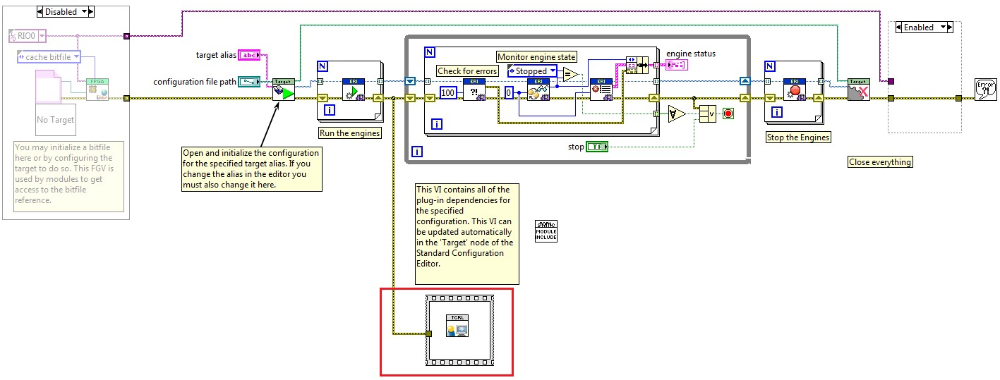|
|:--:|
|*Figure 1.4*|

9.	Open the **Host Main.vi** Front Panel. In the configuration file path control browse for **SymulatedSystem.pcfg** located at **\\Hands On\Hands-On_1\Exercises\Temperature Controller**.  Select this as default value for this control by going to **Edit >> Make Current Values Default**. Save and Close this VI.

### Part B: Adding Required Classes

DCAF has been developed using LabVIEW Object Oriented Programming. Therefore, the code will only run if the classes used within a specific configuration are added to the project. DCAF provides a simple script that will help you with this every time you add or remove modules to a target in the Configuration Editor. This is not automatic, so you have to remember to run this scripting tool when you make these kinds of changes in the configuration.

1.	Open the Standard Configuration Editor by navigating in LabVIEW to **Tools>>DCAF>>Launch Standard Configuration Editor…**
2.	Within the editor, navigate to **Tools>>Edit Plugin Search Paths**.
3.	We will reuse existing modules that were developed for this exercise. Add a search path to the plugins for this example located at **\\Hands On\Hands-On_1\Exercises\Temperature Controller\Modules** if it’s not already there. Click *OK* once this path has been added.
4.	In the DCAF Configuration Editor go to *File>>Open* and browse for the **SimulatedSystem.pcfg** configuration file located at **\\Hands On\Hands-On_1\Exercises\Temperature Controller**.
5.	Take a couple of minutes to go through each component in the Simulation and UI Engines.

	a. **Tags**: A **Tag** can be defined as a connecting point between **Channels** from different **Modules**. All the *Tags* available in a given engine will show up in this pane. Considering this, all the engines must have a *Tags* section. *Tags* can be created from this pane or from the modules configuration. 

	b. **Mappings**: Mappings are the connections between **Tags** and **Channels**. If you want a specific Channel to write or read a value on a specific *Tag* you will have to map them. All the existing *Mappings* in a given engine will show up in this pane. Considering this, all the engines must have a *Mappings* section.

	c. **Temperature Controller Logic**: This is a custom DCAF Module designed to provide the control logic for the temperature chamber. Check how the module pane displays a list with all its channels and their corresponding *mapping* with a *tag* in the engine.

	d. **Temperature Chamber Model**: This is a custom DCAF module that provides a simulated model of a Temperature Chamber. Check how the module pane displays a list with all its channels and their corresponding *mapping* with a *tag* in the engine.

	e. **UDP**: This is a standard module installed with DCAF and it has been added to both *engines*. It is designed to share tags between *engines* by mapping each tag as an Engine Input or Output. All tags that are intended to be shared between engines need to be defined in the Tags Pane of each engine with the same names.

	f. **UI Reference**: This is a standard module installed with DCAF. This module takes a pre-existing front panel and maps its controls and indicators to DCAF tags to permit direct user interaction with the framework.

6.	Open the Temperature Controller project located at **\\Hands On\Hands-On_1\Exercises\Temperature Controller\Runtime\Project** if not already opened.
7.	Open **Host Module Includes.vi** and verify the Block Diagram is empty. This VI will load the required classes when **Host Main.vi** executes. We will use a scripting tool to add the corresponding classes to **Host Module Includes.vi**.

8. Go back to the DCAF Editor. In the System Configuration hierarchy select PC. In the Includes file path box browse for  **Host Module Includes.vi** located at **\\Hands On\Hands-On_1\Exercises\Temperature Controller\Runtime\Project**.

||
|:--:|
|*Figure 1.5*|

9. Press the Generate button. This will start scripting the **Host Module Includes.vi** to contain the classes being used by our configuration.

10.	Verify that the corresponding classes have been added to **Host Module Includes.vi** and compare them to Figure 1.6:

| 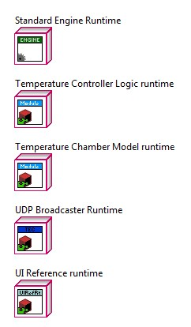|
|:--:|
|*Figure 1.6*|

**Note**: This same process has to be repeated every time you add a new type of module to your configuration.

11.	Save and close **Host Module Includes.vi**. Keep the DCAF Editor open for the next section of the exercise.

### Part C: Mapping Tags in the Configuration Editor

This DCAF project has 2 engines: **The Simulation Engine** and the **UI Engine.** Both engines have listed Tags, Mappings, and UDP items. The rest are specific modules for each engine.
-	The **Tags** item refers to the list of tags in the Tag Bus for each engine.
-	The **Mappings** item allows to configure and visualize the connections between each **Module** parameter (Input/Output) and the Tag Bus.
-	The **UDP** item publishes tags that can be shared with another engine that might be in the same target or in a different one.
During this last part of the exercise you will learn how to map **Tags** between Modules through the Tag Bus in each Engine and share Tags between Engines through UDP.

Before we start the implementation, take a look to the following diagram to understand how data flows through Modules and Engines of our Simulated Temperature Controller.

||
|:--:|
|*Figure 1.7*|

1.	Open the Standard Configuration Editor by navigating in LabVIEW to **Tools>>DCAF>>Launch Standard Configuration Editor…**
2.	We will first map our UI to the UI Engine Tags. Beneath the UI Standard Engine select UI Reference. Notice the table in the Static Configuration tab is empty. Press the Browse button next to the UI to Load textbox. Browse for **TCRL User Interface.vi** located at **\\Temperature Controller\Runtime**.
3.	Press the **Configure from UI** button. When the pop up asking to Automatically map tags to channels appears select Yes. Verify your mappings comparing them with Figure 1.8.

||
|:--:|
|*Figure 1.8*|

4.	Save the changes in the Configuration Editor.
5.	Open and run **TCRL Host Main.vi**. Try changing the Setpoint and the other controls. Do you see any change in the temperature value displayed in the Graph?

|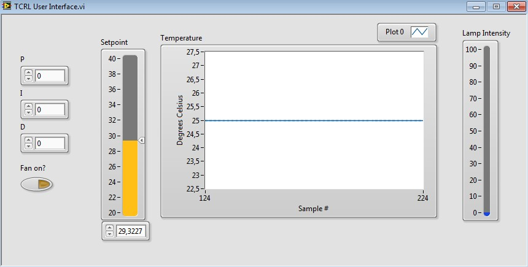|
|:--:|
|*Figure 1.9*|

**Note:** You shouldn’t see any change in the signal since we only connected the tags in the UI Engine. There are still some tags in the Simulation Engine that we need to map so we can see the PID standard behavior.

6.	Stop the **TCRL Host Main.vi** and return to the Configuration Editor. We will review the connections in each component on both engines to understand the tag dataflow and connect the tags that are missing to make it run.

7.	We will start with the **Simulation Engine**. First select the Tags node and take a look at the tags.

||
|:--:|
|*Figure 1.10*|

8.	These tags are used for connections in the rest of Simulation Engine modules: Temperature Controller Logic, Temperature Chamber Model and UDP. Notice all of them are Doubles except for **Fan on?**.

9.	Go to **Mappings** under the Simulation Standard Engine and select the **Manual Mapping** tab. This section will allow you to have a better look of the tag flow in this application. In the left pane you will see all the channels that haven’t been mapped. Just look, don’t make changes.

|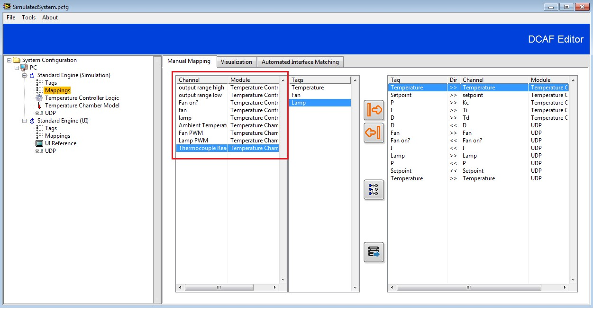|
|:--:|
|*Figure 1.11*|

10.	Go to the Temperature Controller Logic Module. Notice there are two variables that don’t appear in the Tag list: **output range high** and **output range low**. These are internal variables with constant values defined statically. The rest should be mapped to a tag.

11.	The last 3 channels should be connected to a tag (**Fan on?**, **fan**, and **lamp**). To connect a channel to a tag, take the cursor to the corresponding cell in the **Mapped to System Tag** column, left click, and select the corresponding tag from the **Available Tags** list.

||
|:--:|
|*Figure 1.12*|

12.	Verify your table looks like the following image:

||
|:--:|
|*Figure 1.13*|

13.	Before going to the next module notice the **Direction** column. **Processing parameters** are module inputs while **processing results** are module outputs. Some of the processing parameters in this module come from the UI Engine and others come from the Temperature Controller Logic Module. The two processing results in this module will go through the Tag Bus as inputs in the **Temperature Chamber Model** module.

14.	Go to the **Temperature Chamber Model** module. Notice all the channels are disconnected from any tag. The only disconnected channel should be **Ambient Temperature**. Create the following connections. **Fan PWM** and **Lamp PWM** channels are processing parameters in this module that should come from the **Temperature Controller Logic Module**. **Thermocouple Reading** is a processing result that should be used as the feedback signal in the **Temperature Controller Logic Module** and will also be sent to the UI Engine to be displayed in the graph. Following the same instructions as in step 11, map **Fan PWM**, **Lamp PWM**, and T**hermocouple Reading** channels to **Fan**, **Lamp**, and **Thermocouple** tags. Verify your table looks like the following image:

|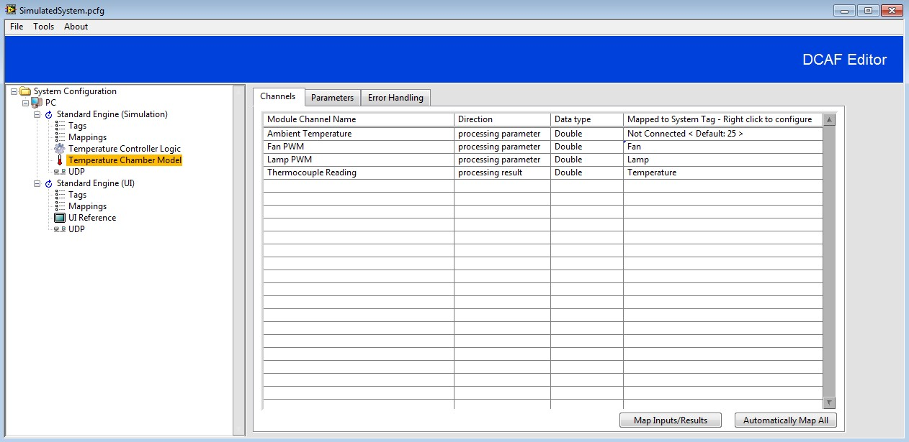|
|:--:|
|*Figure 1.14*|

15.	Go to the **UDP Module** in the **Simulation Engine**. Go to the **Channel Mapping Tab**. Notice the tags in the From External Engine (Inputs) and To External Engine (Outputs) boxes. Notice the Fan tag is still as an **Available Tag**. There is no need to move it since it is not needed in the UI Engine, it is only used internally in the **Simulation Engine**.

|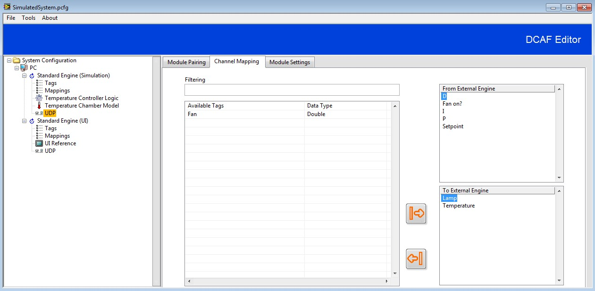|
|:--:|
|*Figure 1.15*|

16.	Go back to **Mappings** in the **Simulation Engine**. Notice now there are only 3 channels that haven’t been mapped. There are no tags for those channels since they are configured statically in their corresponding modules or set as default. All the channels that originally were unmapped now appear mapped in the right pane. Take some time to review the mapping directions to have a better understanding of the data flow.

||
|:--:|
|*Figure 1.16*|

17.	Now that you have seen how the **Simulation Engine** works, step into the different components of the UI Engine to understand how it interacts with the **Simulation Engine**. Notice that the Inputs for the **UI Engine UDP Module** are the Outputs for the **Simulation Engine UDP Module** and vice versa.

| 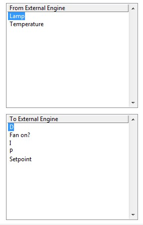|
|:--:|
|*Figure 1.17*|

18.	Take a look again to the dataflow diagram to review the mapping you just did.

||
|:--:|
|*Figure 1.18*|

19.	Go to **\| File >> Save** and close the Configuration Editor.
20.	Open the **Temperature Controller Example Project** if not already open. Open and run **Host Main.vi.**
21.	Modify the **Setpoint** and the other controls in the UI. You should now see the temperature being controlled by the **Simulation Engine**.

||
|:--:|
|*Figure 1.19*|

## Exercise 2: Adding Standard Modules to the Temperature Control Application (TDMS & CVT)
In Exercise 1 you developed a Simple Temperature Control Application using DCAF. Now, we will add standard features such as TDMS and CVT to learn how to add standard DCAF modules to your application.

### Part A: Add TDMS

Adding TDMS is a specific module that might become really handy in a DCAF application. This part of the exercise will guide you through the process of adding TDMS logging to your DCAF application.

1.	Open the **Temperature Controller** project you developed in Exercise 1 if not already opened.
2.	Open the **Configuration Editor** and load **SimulatedSystem.pcfg** if not already opened.
3.	Right click the **Simulation Engine** and select **Add>>Utilities>>TDMS datalogger** as shown in Figure 2.1.

|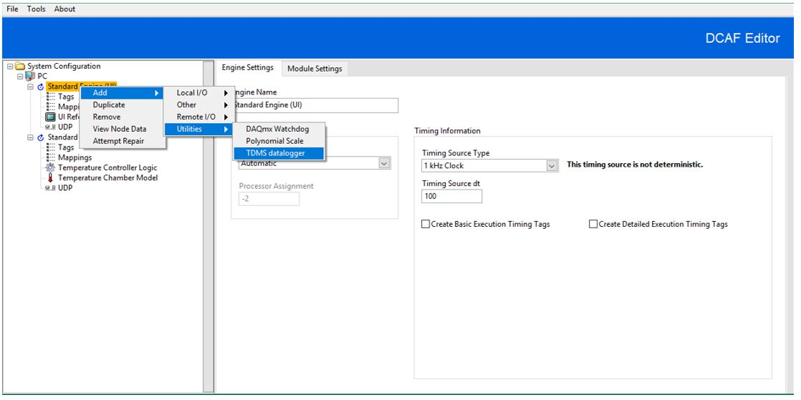|
|:--:|
|*Figure 2.1*|

4.	Select the **TDMS datalogger** item you just created. In the Static Configuration tab move Temperature, Setpoint, P, I, and D to the **Configured to Log** box.

|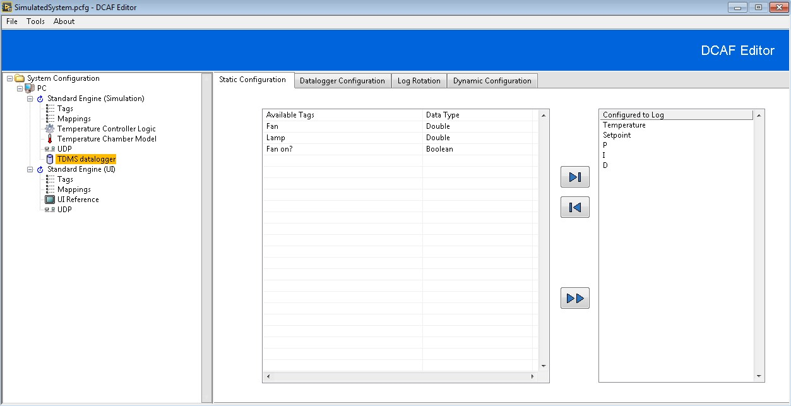|
|:--:|
|*Figure 2.2*|

5.	Go to the **Datalogger Configuration** tab. Press the browse button to select a File path. Browse to **\\Temperature Controller\Runtime** and create a folder named **Data**. Type Temperature Measurements as the File name.
6.	Go to the Log Rotation Tab. In here we can configure a maximum size for each file before a new one is created. Press the browse button to select a Historical Directory. Browse to **\\Temperature Controller\Runtime** and create a folder named **Historical**. In this folder our files will be saved once they get to the maximum size we configured.

|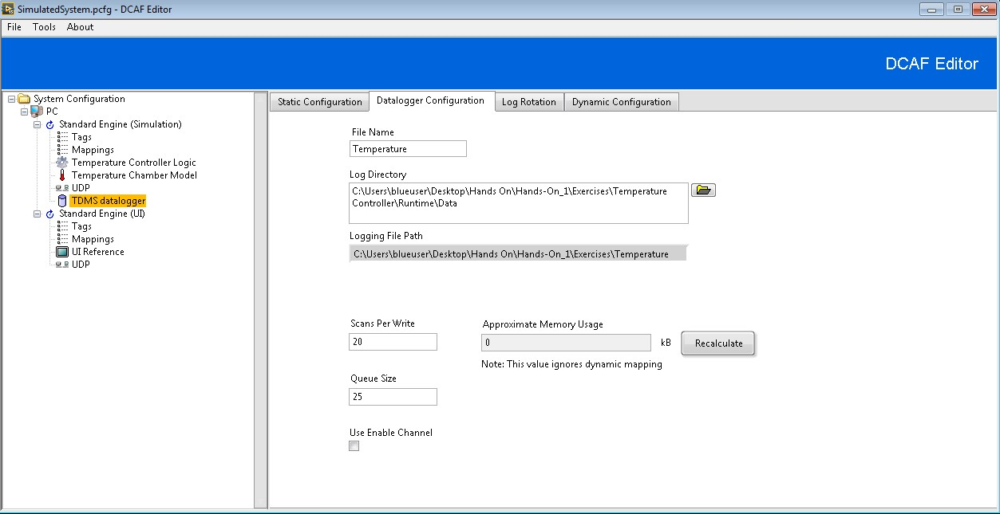|
|:--:|
|*Figure 2.3*|

7.	Since we added a new module, loaded classes should be updated. Use the scripting tool explained in **Exercise 1>>Part 2>>Step 7** to update the classes in **TCRL Host Module Includes.vi**. The option to re-generate the Includes VI is in the PC Configuration. Verify the class has been successfully added to **TCRL Host Module Includes.vi**.

|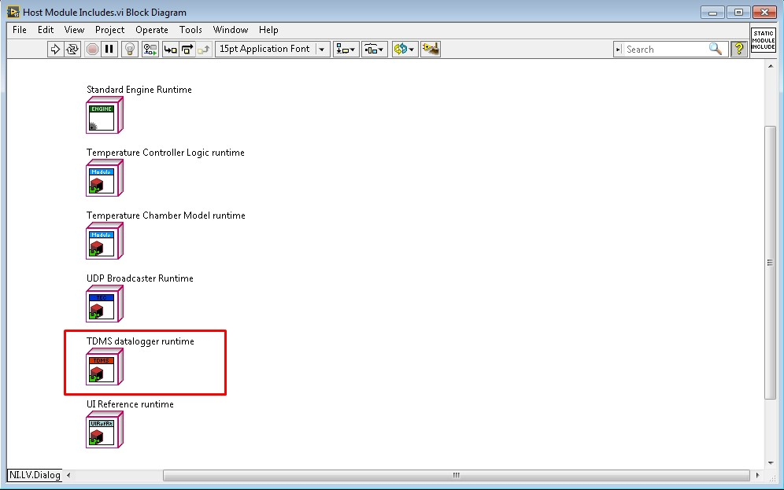|
|:--:|
|*Figure 2.4*|

8. **Run TCRL Host Main.vi**. Do some changes to the setpoint and verify it still working and stop the VI.
9.	Go to the Historical folder you created located at \\Temperature Controller\Runtime\Historical and open the TDMS file just created. Verify the tags you added in the TDMS datalogger modules appear in the file and generated data. 
**Note**: if the file is not in **Historical** folder, the configuration migth be wrong or the file is open and it is still on the **Data** folder.

||
|:--:|
|*Figure 2.5*|

### Part 2: Add CVT

Sometimes you will need to share tags with code that might run asynchronously in parallel with the DCAF engine. Current Value Table (CVT) is a component that provides a simple interface between DCAF and other LabVIEW code.
During this part of the exercise we will publish the Temperature tag and visualize it in the Front Panel of your TCRL Host Main.vi.
1.	Open the **Temperature Controller** project if not already opened.
2.	Open the **Configuration Editor** and load **SimulatedSystem.pcfg** if not already opened.
3.	Add a CVT module to the Simulation Engine in the same way you added the TDMS datalogger.
4.	Select the **CVT** module. Select **To CVT** direction.

|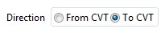|
|:--:|
|*Figure 2.6*|

5.	Move Temperature to the To CVT box.

|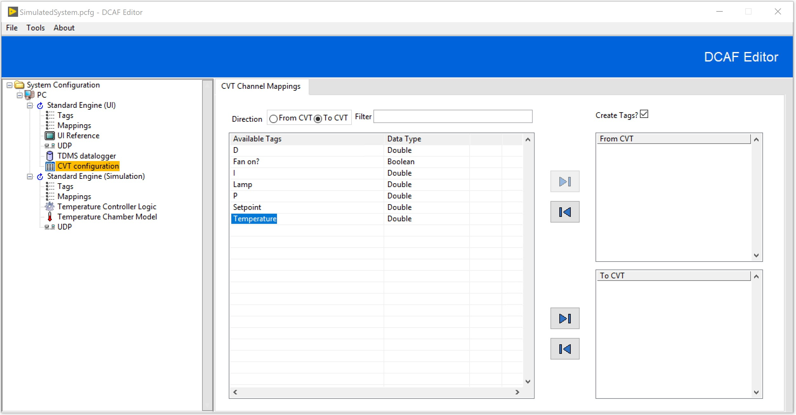 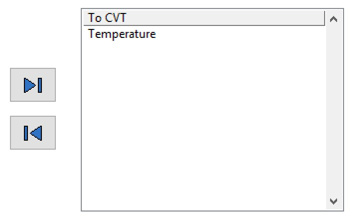|
|:--:|
|*Figure 2.7*|

6.	Save your configuration.
7.	Open **TCRL Host Main.vi** Block Diagram. Add a **Read** VI from the **Current Value Table** Function Palette. By default it is a double. Connect a string constant to the **Tag Name Terminal** and type **Temperature**.

||
|:--:|
|*Figure 2.8*|

8.	Finish the code as shown in Figure 2.9

|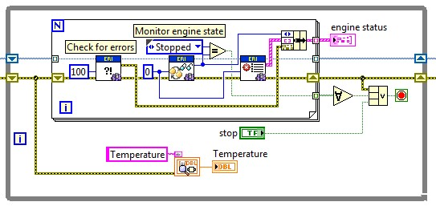|
|:--:|
|*Figure 2.9*|

9.	Rearrange the front panel Indicators such that the new **Temperature** indicator is visible as shown in Figure 2.8.

|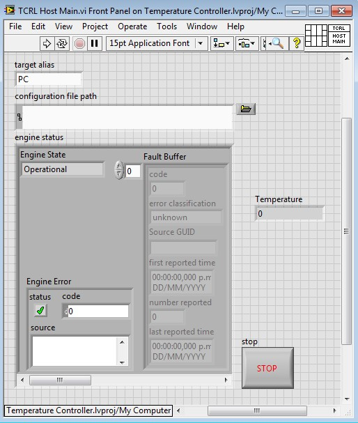|
|:--:|
|*Figure 2.10*|

10.	Save the changes in **TCRL Host Main.vi**. Go back to the Configuration Editor and update the classes for **TCRL Host Module Includes.vi** as you did for the TDMS Datalogger Module. Verify the CVT class is added to **TCRL Host Module Includes.vi.**

|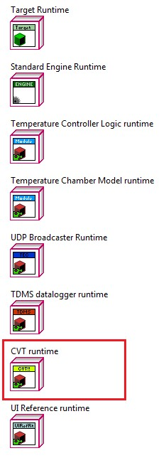|
|:--:|
|*Figure 2.11*|

11.	Run **TCRL Host Main.vi**. The UI should still be working. Verify the value displayed in the new Temperature indicator in **TCRL Host Main.vi** corresponds to the value displayed in the **Temperature** chart in **TCRL User Interface.vi**

||
|:--:|
|*Figure 2.12*|

12.	Stop and close **TCRL Host Main.vi**.
13.	Take a look to the following diagram to verify the updated mappings.

|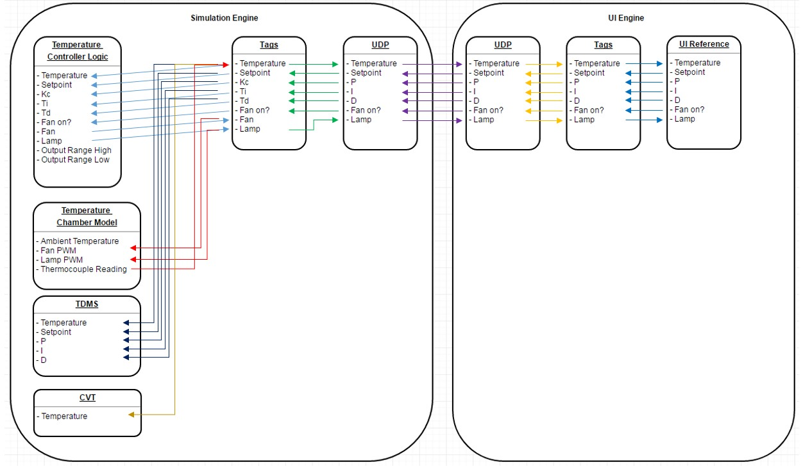|
|:--:|
|*Figure 2.13*|
