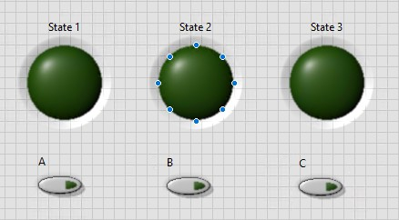

# Markdown_tests
<figure>
  

  
  

  <figcaption align ="center">Figure 2.2 State Machine UI.</figcaption>
  

</figure>

*Figure 1.13*

||
|:--:|
| *Figure 1.13*  |

  

  
  

 Figure 2.2 State Machine UI.
  

  |
  |:--:|
  | *Figure 1.13*  
