# Hands-On 3: Dynamic Module
This hands-on covers the creating of a DCAF Dynamic module, this modules are advance modules that provide additional flexibility as the number of channels of the module are configured by the final user.
It is recommended that the Hands-On 1 and 2 are completed before doing this one Hands On.

<!-- TOC depthFrom:1 depthTo:6 withLinks:1 updateOnSave:1 orderedList:0 -->

- [Hands-On 3: Dynamic Module](#hands-on-3-dynamic-module)
	- [Exercise 1 Multiplexer Module:](#exercise-1-multiplexer-module)
			- [Concepts Covered:](#concepts-covered)
			- [Module Definition:](#module-definition)
		- [Part A: Dynamic Module Creation and Configuration](#part-a-dynamic-module-creation-and-configuration)
		- [Part B: Dynamic Module Runtime](#part-b-dynamic-module-runtime)
		- [Part C: Dynamic Module Editor Node](#part-c-dynamic-module-editor-node)
		- [Part D:  Create a a DCAF Application that runs the Static Module](#part-d-create-a-a-dcaf-application-that-runs-the-static-module)

<!-- /TOC -->

## Exercise 1 Multiplexer Module:

#### Concepts Covered:
- Dynamic Module Creation
- Dynamic Module Configuration Class overrides
- The use of Lines Cluster and Methods
- Dynamic Module Runtime Class overrides
- Dynamic Module Editor Node Class overrides
- Use of the Table API
- Dynamic Module Unit Testing
- Module Level Configuration parameters

#### Module Definition:
 - This Dynamic Processing module will select between 2 input Double channel  which will be sent as an output based on a Boolean input.
 A single module must support multiple multiplexers
 - Input Channels will be Doubles, output will be Double and the select a Boolean.
 - There is a scaling multiplier that affect all modules, and multiply the output. This is defined in the configuration and has a default value of 1.

### Part A: Dynamic Module Creation and Configuration
1. Create a dynamic module using the DCAF Dynamic Channel Module template.

|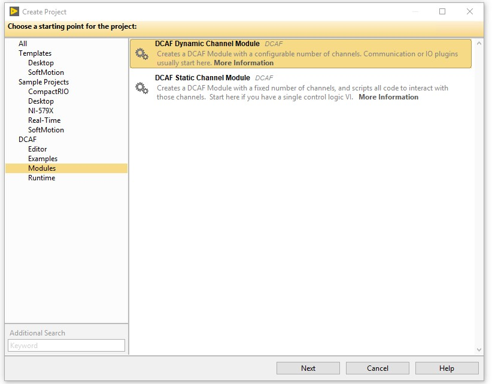|
|:--:|
|*Figure 1.1*|

2. Configure your module to allow multiple instances, allow running on any target and supporting only doubles and booleans as datatypes.
3. Locate and modify **Line.ctl** with channels and settings needed for a given line to operate. In this case we will create separate channels for the inputs ‘A’, ‘B’ and ‘Select’ and the output ‘Output’. 

|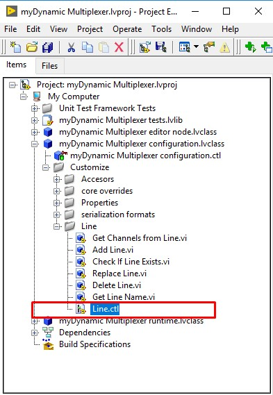|
|:--:|
|*Figure 1.2*|

|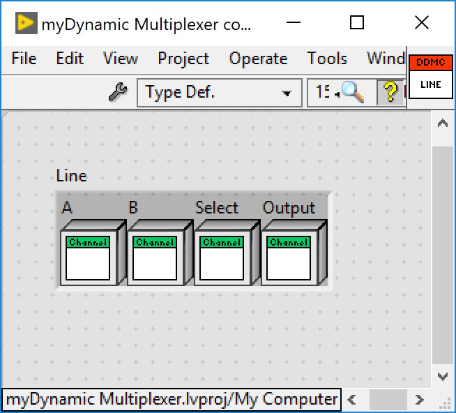|
|:--:|
|*Figure 1.3*|
 
4. Modify **Get Line Name.vi** so our line can provide an unique name for each line. Name can be taken from any of the channels in the line or included as one of the settings in the line itself. In the example below, we extract the name of the channel A. Channels will have a name with format *LineName_ChannelName*. We use the **Match Pattern VI** to extract the contents before the underscore and obtain the line name we are looking for. 

||
|:--:|
|*Figure 1.4*|

5. Modify **Get Channels from Line.vi** so it returns an array with all the channels present in the line.

|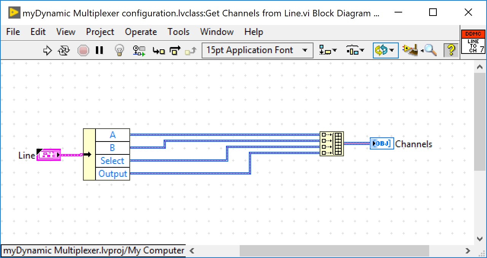|
|:--:|
|*Figure 1.5*|

6. Modify **to string.vi (to string 1.0.vi)** so our class can store the information configured by the user in a string. In the example below, we store in a single section all the lines configurations. In another section we store our scale since it applies to all our lines. 

||
|:--:|
|*Figure 1.6*|

|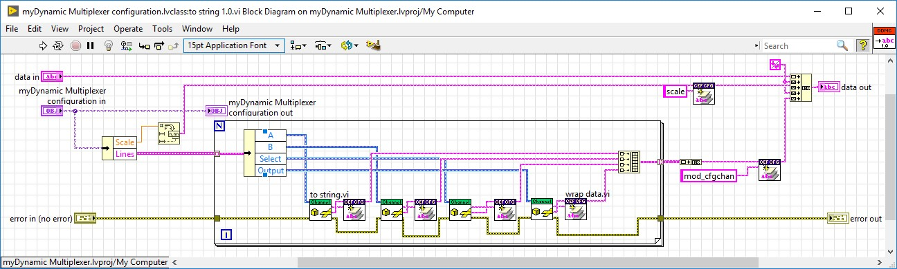|
|:--:|
|*Figure 1.7*|

7. Modify **from string.vi (from string 1.0.vi)** so our class can retrieve the information configured by the user from a string.

|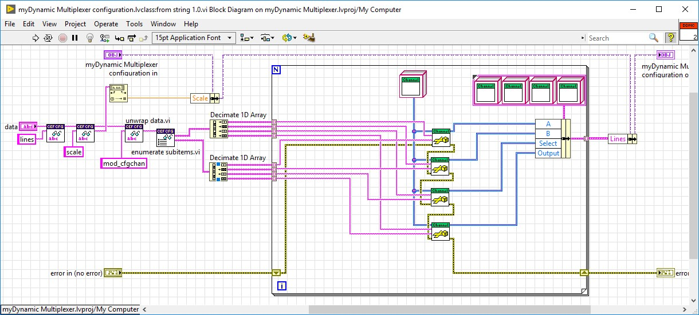|
|:--:|
|*Figure 1.8*|

8. Modify the **get channels.vi** so we can read all the channels configured for all our lines in a single array. In here we can reuse the **Get Channels from Line.vi** modified previously.

|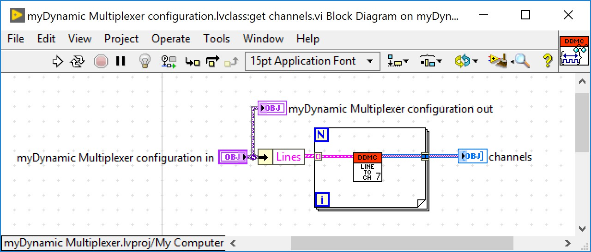|
|:--:|
|*Figure 1.9*|

9. Modify the private data of our configuration class so it includes general settings that apply for all our lines or other relevant data for our module to operate. In this case we include a double numeric element to store our Scale.

||
|:--:|
|*Figure 1.10*|

10. Create data accessors for the extra elements we added in the previous step. To make this right click on your configuration class and select New >> VI for Data Member Access…

|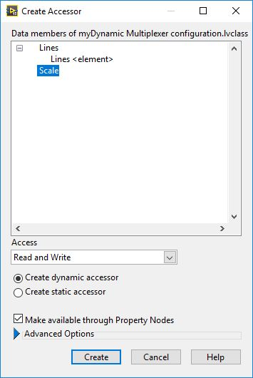|
|:--:|
|*Figure 1.11*|

||
|:--:|
|*Figure 1.12*|

||
|:--:|
|*Figure 1.13*|

#### Testing the Configuration Class

1. Modify the **Create Test Configuration.vi** in the tests library that was automatically scripted as a part of the project template. In this VI we want to create a known configuration class with different settings for our lines. This test configuration will be used to test functionality of other VIs in the configuration, runtime and editor node classes.

|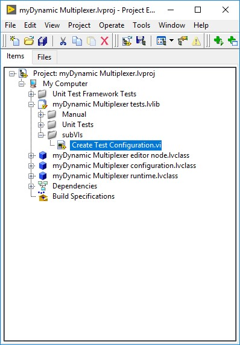|
|:--:|
|*Figure 1.14*|

|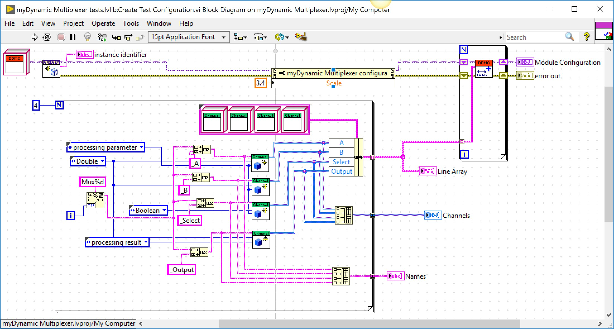|
|:--:|
|*Figure 1.15*|

2. We are now ready to test that our configuration class can store and retrieve its configuration to and from a string. There is a VI already made for this purpose. Open and run the **serialization tests.vi** in the *Unit Tests* virtual folder. The VI should run with no error and the LED indicators should turn ON. Otherwise, use this VI to debug some of the VIs that were previously modified.

|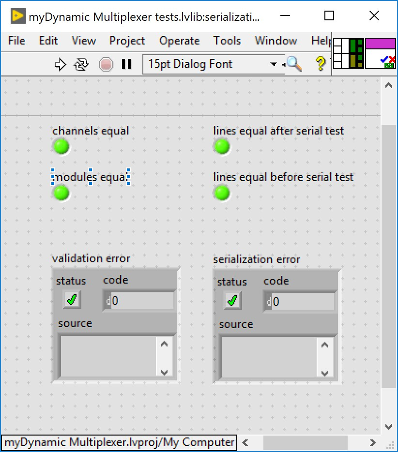|
|:--:|
|*Figure 1.16*|

|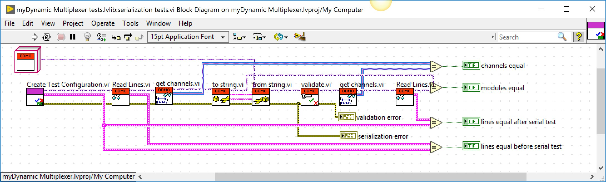|
|:--:|
|*Figure 1.17*|

1. Update the to string and from String Unit test?
1. Implement the From String Array to String Array?
1. Update the From String Array to String Array Unit test?

### Part B: Dynamic Module Runtime
1. Modify the **init.vi**. 
  
  1.1 Create a new typedef called **Line Mappings.ctl**. Use this typedef to store in a cluster the mappings (indexes) for all our channels in the bus for a given line. In this case we don’t need to store the datatype for each of the elements since it will always be the same.

	
|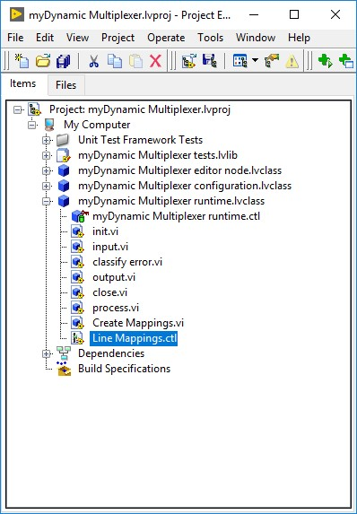|
|:--:|
|*Figure 2.1*|	

|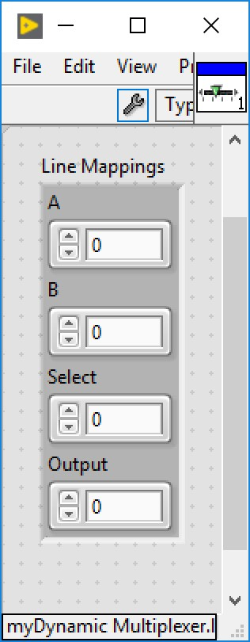|
|:--:|
|*Figure 2.2*|	

  1.2 Modify the private data of the runtime class so it includes the array of mappings. We will use the object to pass our mappings from the **init.vi** to the **process.vi**. Also include a numeric double to store the Scale value.	

|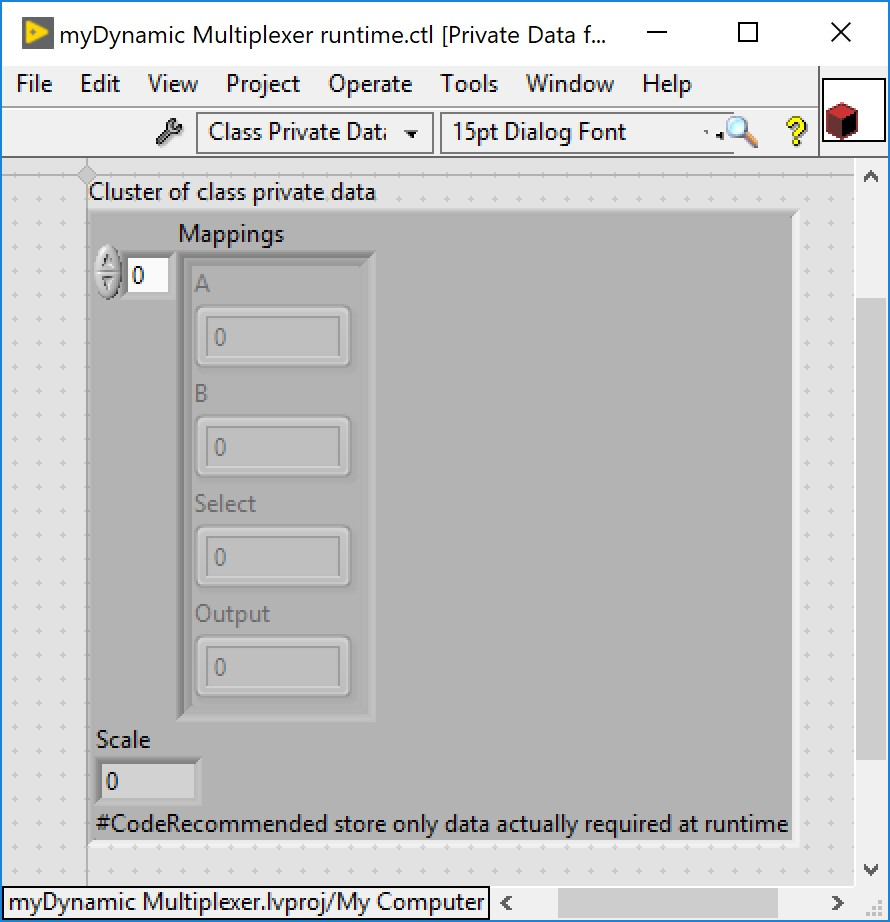|
|:--:|
|*Figure 2.3*|	

  1.3 Create a new VI called **Create Mappings.vi**. Use this VI to search the indexes for all the channels in our lines. Use this information to generate an array with mappings to our channels.
	

|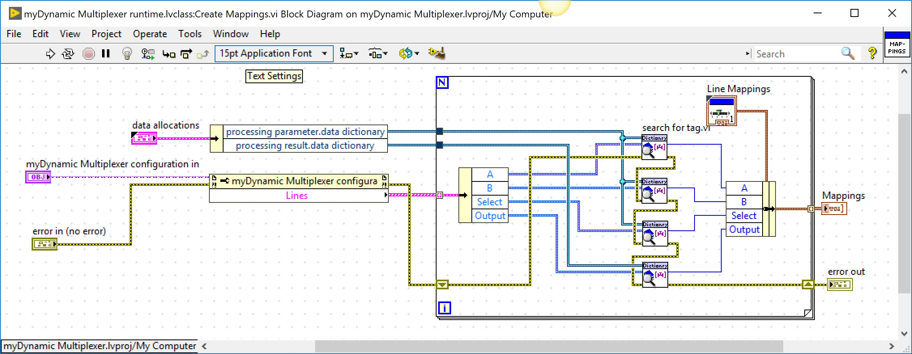|
|:--:|
|*Figure 2.4*|

  1.4 Include the created subVI as a part of the **init.vi** and modify the runtime class with this information. Also extract the Scale value and wire it to the Runtime class.

	
|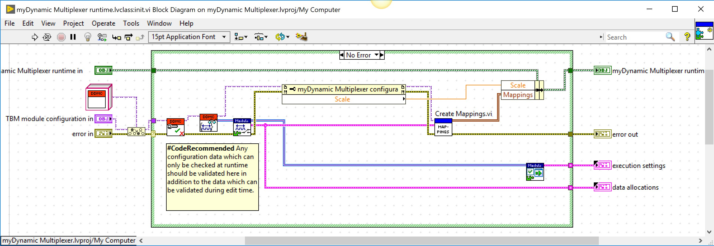|
|:--:|
|*Figure 2.5*|

2. Modify the **process.vi** so it executes our desired functionality. As we already have the indexes for our tags, we simply use the Table API to access our processing and results parameters.

||
|:--:|
|*Figure 2.6*|

#### Testing the Runtime Class
1. Modify the **Runtime Test.vi** in the tests library. This VI is found in the *Manual* folder. Modify the code around the **Process.vi** to write our processing parameters and read the processing result. The names used must match the ones we set in the **Create Test Configuration.vi**. 

|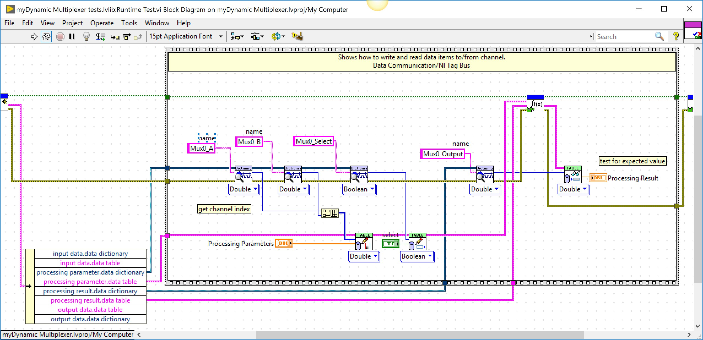|
|:--:|
|*Figure 2.7*|

2. Once modified, run the **Runtime Test.vi** with different inputs and verify the outputs behave as expected. For the example below scale was set to 3.4.

|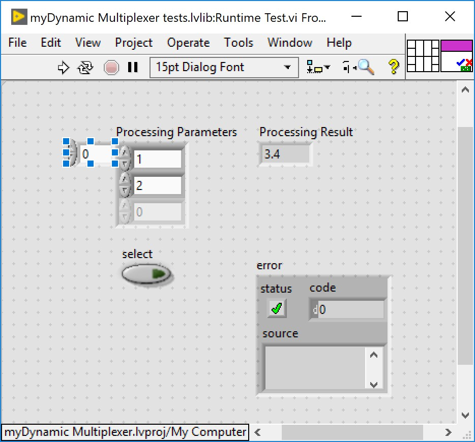|
|:--:|
|*Figure 2.8*|

|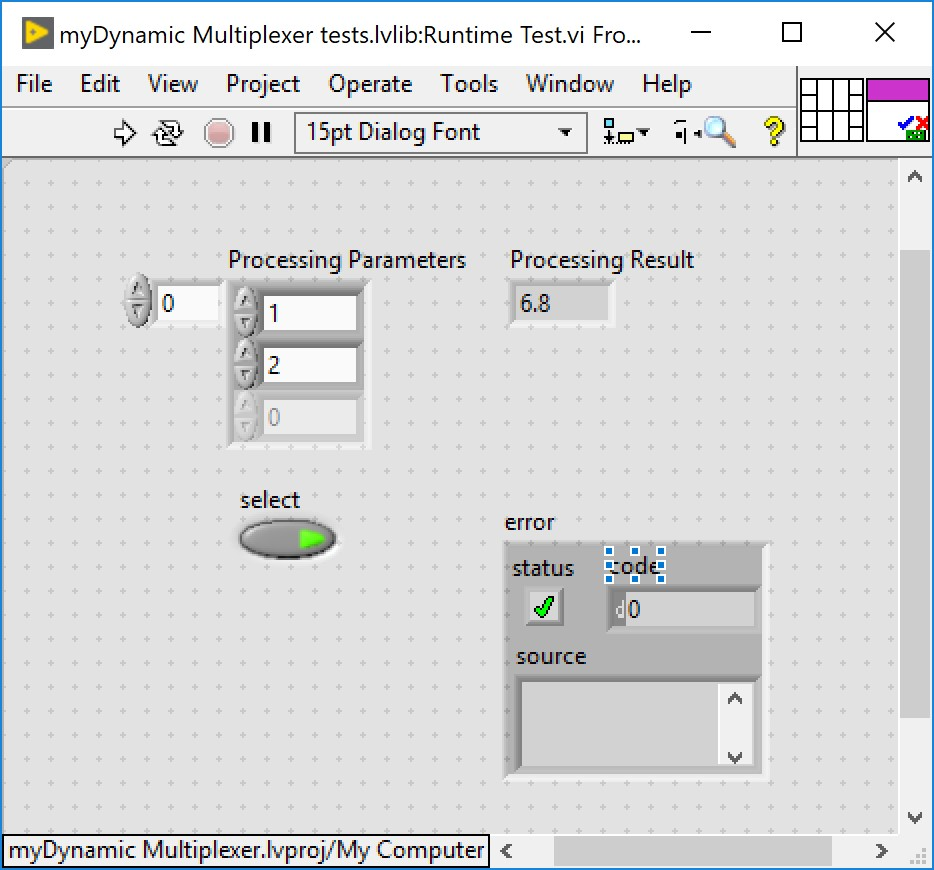|
|:--:|
|*Figure 2.9*|

### Part C: Dynamic Module Editor Node
1. Open the **Main Editor UI.vi**. Add an extra tab for the user to configure general parameters for our module. In this case add a numeric value for the user to be able to modify the *Scale*. 

2. Add an event case to manage UI changes in our parameters and store the new values into our configuration class. 

3. Create another method to read the stored value for the *Scale* from the Configuration Class.

4. Modify **Define Columns.vi** so we can configure the type of elements that is expected in each column of our table. 

5. Modify Callback VIs.

6. Modify **ToTable.vi**

7. Modify **generate default line.vi**.

8. Modify **Line Configuration Dialog.vi**

### Part D:  Create a a DCAF Application that runs the Static Module

